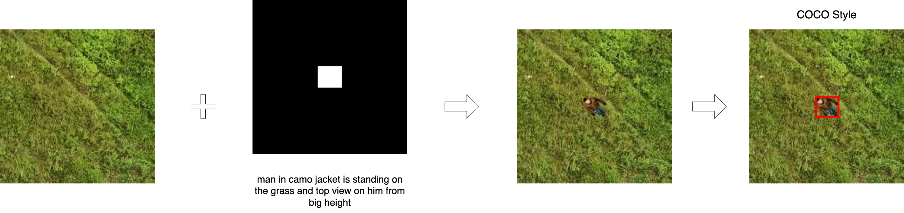

# SyntheticAugmentationGenerator
**_Библиотека для аугментации изображений путём генерации заданных объектов при помощи диффузионных моделей_**



Для установки библиотеки запустите данный код:
```console
git clone https://git.ai-space.tech/t041lk8/synthetic-augmentation-generator
cd syntheticaugmentationgenerator
pip install .
cd ..
```

## Использование
SyntheticAugmentationGenerator позволяет собрать датасет в формате COCO, добавив на исходные изображения объекты, описанные при помощи текстовых подсказок, в случайно выбранных ббоксах.

Для работы с генератором необходимо создать JSON файл в формате:
```json
{
    "classes": [
        {
            "id": 0,
            "label": "label_0",
            "prompts": [
                "prompt №1 for label_0",
                "prompt №2 for label_0",
                ...
            ]
        },
        ...
    ],
    "bboxs": [
        [x_min_0, y_min_0, x_max_0, y_max_0],
        [x_min_1, y_min_1, x_max_1, y_max_1],
        ...
    ]
}
```
На выходе пользователь получит аугментированные изображения и разметку в формате COCO.

Данный генератор можно использовать как из консоли, так и в python коде:
```console
synt-generator [args]
```
или
```python
from SyntheticAugmentationGenerator import AugmentationGenerator

generator = AugmentationGenerator({initial_args})
generator({call_args})
```

## Аргументы
### Инициализация
|Аргумент|Тип|Значение по умолчанию|Описание|
|-|-|-|-|
|source_json|str, os.PathLike|None|Путь к JSON файлу с ббоксами и промптами|
|final_json|str, os.PathLike|None|Путь к JSON файлу в формате COCO|
|dir_images|str, os.PathLike|None|Путь к оригинальным изображениям|
|dir_dataset|str, os.PathLike|None|Путь к аугментированным изображениям|
|weights|str, os.PathLike|stabilityai/stable-diffusion-2-inpainting|Путь к предобученной модели|

### Вызов
|Аргумент|Тип|Значение по умолчанию|Описание|
|-|-|-|-|
|guidance_scale|float|10|Более высокое значение побуждает модель генерировать изображения, тесно связанные с текстовой подсказкой, за счет более низкого качества изображения|
|num_inference_steps|int|50|Количество шагов по снижению шума. Большее количество шагов по снижению шума обычно приводит к более высокому качеству изображения за счет более медленного инференса|
|bb_num|int|1|Количество ббоксов для каждого класса на одном изображении|
|negative_prompt|str|None|Подсказка, указывающая, что не следует включать в генерацию изображений|
|increase_scale|float|1.2|Этот параметр отвечает за значение, на которое умножается размер bbox для выделения области внимания. Этот параметр должен быть больше 1. Данный параметр проигнорируется, если параметр aa_size будет иметь значение отличное от None.|
|aa_size|int|None|Этот параметр отвечает за размер области внимания.|